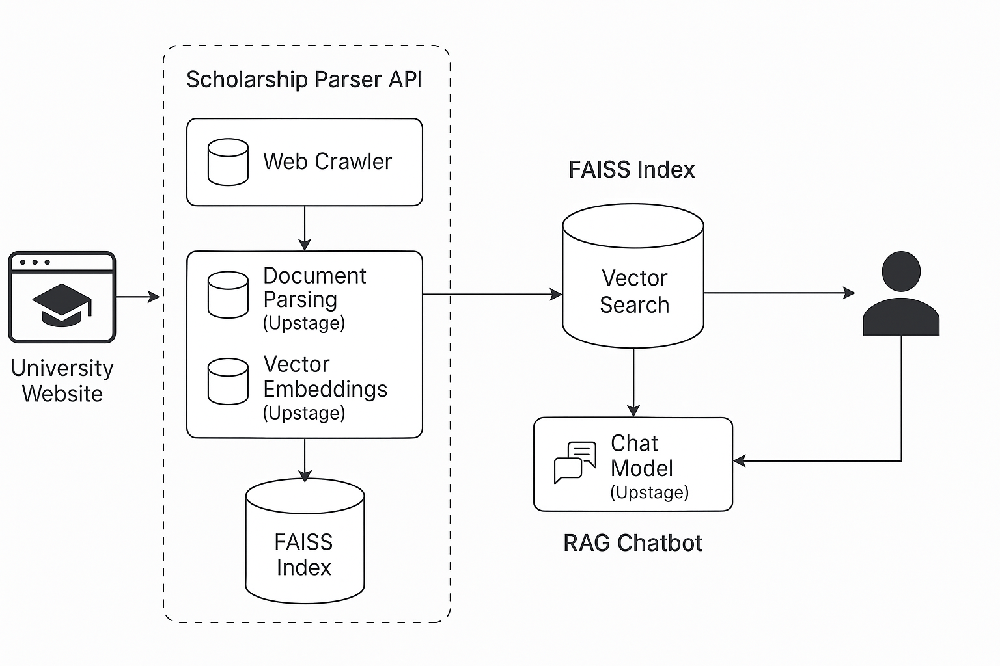

# Upstage Document AI Challenge - SearCh

## 📌 개요
> 부산대학교 장학금 공지의 첨부파일(PDF·HWP 등)을 **AI로 자동 분석**하여  
> _“내 성적·학년·질문_” 에 맞는 장학금을 바로 추천해 주는 검색 서비스입니다.

## ✨ 핵심 기능
| 구분 | 설명 |
|------|------|
| 📄 **공지 수집** | 크롤러가 “장학” 키워드 포함 공지 + 첨부파일 자동 수집 |
| 🧠 **AI Parsing** | Upstage Document-Parsing으로 첨부파일 → 텍스트/HTML 변환 |
| 🔎 **리스트·필터** | GPA·학년·재학 상태 조건 필터 & 리스트 뷰 |
| 🤖 **자연어 검색** | “3학년인데 GPA 3.8, 받을 장학금?” → LLM + RAG 결과 |
| 📑 **조건 추출** | 첨부파일에서 **신청 자격·기한·최저 GPA 등** 자동 추출 |
| 🗄 **증분 인덱싱** | SHA-256 중복 제거 + FAISS 인덱스 증분 업데이트 |


## 🎯 문제 정의 및 기대 효과
- 기존의 장학금 공지사항은 단순 게시판 형태로 제공되어, 학생들이 자신의 조건에 맞는 장학금을 찾기 위해 하나하나 공지를 열어보거나 첨부파일을 직접 확인해야 하는 번거로움이 있었습니다.
- 이 앱을 통해, 학생들이 보다 편리하게 장학금 정보를 탐색할 수 있고, 이전이라면 놓쳤을 수도 있는 장학금 기회를 휴대폰으로 더욱 쉽게 확인하고 신청할 수 있도록 돕습니다.

## ✅ Upstage API 활용
- **Upstage Document-Parsing**: 장학금 링크 내 첨부파일의 내용(텍스트 및 HTML)을 자동 변환하여, 텍스트로 인식 후 반환.
- **Upstage Embeddings**: FAISS 인덱스 구축 및 유사도 기반 검색을 위한 벡터 임베딩 생성
- **Upstage Chat Model (solor-pro2-preview)**: Parsing된 첨부파일에서, 장학금 조건 추출을 위해 모델 사용
- **Function calling (solar-pro)**: 사용자의 자연어 질문을 해석해 조건에 맞는 장학금 정보를 필터링하고, 그 결과를 리스트 형태로 제공하기 위해 사용.

## 🔧 빠른 시작
```bash
# 1) 저장소 클론
git clone https://github.com/Ea3124/DAIC-Upstair.git
cd DAIC-Upstair

# 2) 서버 세팅
cd server
python -m venv .venv && source .venv/bin/activate
pip install -r requirements.txt
cp .env.example .env        # UPSTAGE_API_KEY 등 입력
uvicorn uvicorn main:app --host 127.0.0.1 --port 8000

# 3) 안드로이드 앱
# Android Studio로 android/ 폴더 열고 실행 (Flamingo 이상 권장)
```


## 🚀 주요 기술
- ✨ **Web crawling과 Document Pasring을 통한 공지사항 첨부파일 자동 수집 및 분석**
  - 웹 크롤링을 통해, 공지사항중 장학 키워드만 골라서 링크 및 첨부파일 반환
  - 이때 Upstage Document Parsing을 이용한 텍스트 추출 및 파싱
  - 최신화를 위해 다시 긁어오는 경우 중복 수집 방지를 위해, 각 공지사항당 SHA-256 해시를 걸어 똑같은 정보 수집시 중복으로 판단 후 다음 파일로 이동
- ✨ **FAISS 벡터 인덱스 구축 및 업데이트**
  - Embedding Model을 사용하여, parsing한 텍스트들을 FAISS DB구축
  - 메타데이터 생성을 통한 유사도 검색시 어떤 장학금인지 마킹
  - Chat Model을 사용한 장학금 조건 키워드 매칭 후, RDB의 document table에 조건이 포함된 document 객체 추가
- ✨ **FastAPI 기반 Android Studio와 연동**
  - 공지사항 목록 및 첨부파일 정보 제공
  - 최신 공지사항 수집 후 안드로이드로 api 송신
- ✨ **Function Calling 기반 자연어 검색 (NL Search)**
  - RAG와, Function Calling을 사용해 자연어 검색과, 그에 알맞은 함수를 선택하여 불러옴으로써, 알맞게 필터링된 장학금 리스트뷰를 제공한다
  - 정량적일 경우, GPA 및 지역 조건에 따라 내부 쿼리함수를 호출해 RDB 데이터 제공

## 🖼️ 데모
[📹 데모 영상 보기 (구글 드라이브)](https://drive.google.com/file/d/1sRtQgRri9KGeOxp2CgRxvq2-dnmkPOwL/view?usp=sharing)

## 📄 시나리오
```
부산대 2학년 재학생 승재는 오늘 아침 “받을 수 있는 장학금이 뭐가 있을까?” 하는 궁금증이 생겼다. 휴대폰에서 앱을 열면 홈 화면에 최신 장학금 공지가 리스트 형태로 주르륵 나타난다. 이 목록은 실행된 백엔드 크롤러가 “장학” 키워드가 들어 있는 게시글만 추려오고, 첨부파일(PDF·HWP)을 Upstage Document-Parsing으로 텍스트화해 저장-분석한 결과다. 크롤링 과정에서 파일 해시(SHA-256)를 기록해 두기 때문에, 이미 처리한 첨부는 다시 파싱하지 않는다. 새로 들어온 텍스트는 임베딩을 거쳐 FAISS 인덱스에 증분 반영되고, 추출된 “최저 GPA, 신청기간, 지원대상 학년 …” 같은 조건은 RDB에 메타데이터로 들어간다.

민지는 상단 필터 버튼을 눌러 GPA ≥ 3.5, 학년 = 2, 재학 = '재학' 조건을 체크한다. 앱은 GET /documents/filter?min_gpa=3.5&grade=2&status=재학 를 호출하고, FastAPI는 SQLAlchemy 쿼리로 조건을 AND 결합해 DB를 조회한다. 그러면 이에 맞게 공지사항 리스트들이 필터링되어 보여진다.

조금 더 궁금해진 민지는 검색창에 “6월 안에 마감되는 교내 장학금 알려줘” 라고 자연어로 입력한다. 백엔드는 이 질문과 함께 두 개의 도구 — filter_documents_api(DB 필터)와 ask_llm(벡터 검색) — 사양을 Upstage solar-pro 모델에 넘긴다. LLM은 질문에서 “6월”, “마감”이라는 시간 제약과 학년·GPA 정보 부재를 파악하고, 먼저 filter_documents_api를 호출하도록 스스로 결정한다. 함수 인자로 {"end_date":"<= 6월 30일"} 만 전달되어 DB 검색이 실행되고, 결과가 리스트 뷰로 보여진다. 
```

## 🛠️ 주요 기술 스택 및 아키텍처
| Layer | Tech |
|-------|------|
| Backend | Python 3.11 · FastAPI · LangChain · FAISS · SQLAlchemy |
| AI | Upstage Document-Digitization · Solar Embedding · Solar-pro* |
| Crawler | Requests · BeautifulSoup |
| Mobile | Android (Kotlin + Jetpack Compose · Retrofit) |
| DevOps | GitHub Actions (lint/test) |

\* _solar-pro2-preview(Extraction) / solar-pro(Function Calling)_

**시스템 아키텍처**


## 📁 프로젝트 구조
```
DAIC-Upstair/
├── android/                     # Android 앱 프로젝트
│   ├── .idea/
│   ├── app/
│   ├── gradle/
│   ├── build.gradle.kts
│   ├── gradle.properties
│   ├── gradlew
│   ├── gradlew.bat
│   └── settings.gradle.kts
├── server/                      # 서버 백엔드 (FastAPI + LangChain)
│   ├── db/                      # 데이터베이스 모델 및 설정
│   ├── faiss_index/             # FAISS 인덱스 저장소
│   ├── routes/                  # FastAPI 라우터 (API 엔드포인트)
│   ├── utils/                   # 유틸리티 함수 모음
│   ├── .env.example             # 환경변수 설정 예시
│   ├── .gitignore
│   ├── README.md                # 서버 설명서
│   ├── known_hashes.json        # 중복 파싱 방지를 위한 해시 저장소
│   ├── main.py                  # 서버 메인 애플리케이션
│   ├── requirements.txt         # Python 패키지 의존성
│   └── simple_fastapi_auth.py   # 간단한 FastAPI 인증 모듈
├── .gitignore
│
├── README.md                    # 전체 프로젝트 설명서
└── SearCh.apk.zip               # 안드로이드 apk

```

## 🧑‍🤝‍🧑 팀원 소개
 |  |  |  |
|:---:|:---:|:---:|
| [이승재](https://github.com/Ea3124) <br> 팀장 / 백엔드 개발 <br> leesj6717@gmail.com | [박준혁](https://github.com/JakeFRCSE) <br> 백엔드 개발 <br> eppi001004@gmail.com | [김정희](https://github.com/lovelhee) <br> 안드로이드 개발 <br> jenny8530@naver.com |
|  |  |
|:---:|:---:|
| [이병찬](https://github.com/mark77234) <br> 안드로이드 개발 <br> mark77234@naver.com | [금비](https://github.com/Bee-Geum) <br> 인공지능 모델 <br> cusoonbee@gmail.com |


## 💡 참고 자료 및 아이디어 출처
- *Upstage Document Parse
- *Scolo | Personalized Scholarship Finder
- *New AI-driven platform matches students with scholarships
- *문서의 구조를 완벽히 이해하는 LLM, Upstage Solar Pro 제대로 사용하기(gpt-4o 와의 비교)
- *LangGraph Retrieval Agent를 활용한 동적 문서 검색 및 처리 - 테디노트
- *Upstage Building end-to-end RAG system using Solar LLM and MongoDB Atlas
- *CH08 임베딩(Embedding) - <랭체인LangChain 노트> - LangChain 한국어 튜토리얼
- *12. UpstageLayoutAnalysisLoader - <랭체인LangChain 노트> - LangChain 한국어 튜토리얼
