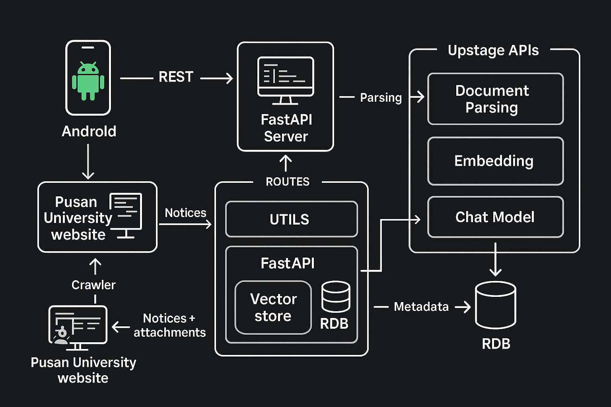

# [장학금 매칭 시스템]

## 📌 개요
부산대학교 컴퓨터공학과 홈페이지에서 장학금 관련 공지사항의 첨부파일을 자동으로 수집 및 분석하여, 조건별 장학금 정보를 제공하고 자연어 질의응답 기능까지 제공하는 **AI 기반 학사 정보 처리 시스템**이다.

## 🎯 문제 정의 및 기대 효과
- 기존 학사 공지사항은 단순히 게시판 형태로 제공되어, 수많은 공지 중 필요한 정보를 찾는 데 많은 시간이 소요된다. 
- 이 프로젝트는 공지사항 첨부파일을 자동 파싱 및 인덱싱하고, 학점/지역 조건 및 자연어 질의로 빠르게 정보를 찾을 수 있도록 설계되었다.  
  
🌟 사용자에게 다음과 같은 서비스를 제공한다:
 - 신속한 장학금 정보 탐색
 - 키워드 기반 매칭 및 검색 결과 제공
 - RAG 기반 대화형 챗봇을 통한 학사 정보 제공

## ✅ Upstage API 활용
- **Upstage Document-Digitization**: 공지사항 첨부파일의 내용(텍스트 및 HTML) 자동 변환
- **Upstage Embeddings**: FAISS 인덱스 구축 및 유사도 기반 검색을 위한 벡터 임베딩 생성
- **Upstage Chat Model (SOLAR)**: 자연어 질문에 대해 검색 결과 및 대화 이력을 바탕으로 답변 생성

## 🚀 주요 기능
- ✨ **공지사항 첨부파일 자동 수집 및 분석**
  - SHA-256 해시를 활용해 중복 처리
  - Upstage Document-Digitization을 이용한 텍스트 추출 및 파싱
  - 장학금 조건 키워드 매칭 및 메타데이터 생성
- ✨ **FAISS 벡터 인덱스 구축 및 업데이트**
  - RecursiveCharacterTextSplitter로 텍스트 청크화
  - Upstage Embeddings를 통한 벡터 생성 및 유사도 검색
- ✨ **FastAPI 기반 REST API**
  - 공지사항 목록 및 첨부파일 정보 제공
  - 최신 공지사항 수집
- ✨ **RAG 기반 자연어 질의응답 (Chatbot)**
  - Upstage SOLAR API를 이용해 검색 결과 및 대화 이력을 바탕으로 응답 생성
  - GPA 및 지역 조건에 따라 내부 함수를 호출해 데이터 제공

## 🖼️ 데모
> 추후 구글 드라이브 링크 또는 GIF/이미지 추가 예정  
예시:  


## 🔬 기술 구현 요약
- LangChain 기반 벡터 검색 및 파이프라인 처리
- Upstage Document Parsing 및 Embeddings 모델 활용
- Upstage SOLAR 모델(Function Calling 포함) 기반 자연어 응답 생성
- FAISS 인덱스 로컬 영속화 및 증분 업데이트
- BeautifulSoup 및 Requests 기반 웹 크롤러 구현
- FastAPI로 RESTful API 제공

## 🧰 기술 스택 및 시스템 아키텍처
- **언어 및 프레임워크**: Python 3.10, FastAPI, LangChain, FAISS, BeautifulSoup
- **AI 모델**: Upstage Document-Digitization, Upstage Embeddings (solar-embedding-1-large), Upstage Chat Model (SOLAR)
- **시스템 아키텍처**


## 🔧 설치 및 사용 방법
```
git clone https://github.com/Ea3124/DAIC-Upstair.git
cd DAIC-Upstair/server
pip install -r requirements.txt
```

## 📁 프로젝트 구조
```
DAIC-Upstair/
├── android/                     # Android 앱 프로젝트
│   ├── .idea/
│   ├── app/
│   ├── gradle/
│   ├── build.gradle.kts
│   ├── gradle.properties
│   ├── gradlew
│   ├── gradlew.bat
│   └── settings.gradle.kts
├── server/                      # 서버 백엔드 (FastAPI + LangChain)
│   ├── db/                      # 데이터베이스 모델 및 설정
│   ├── faiss_index/             # FAISS 인덱스 저장소
│   ├── routes/                  # FastAPI 라우터 (API 엔드포인트)
│   ├── utils/                   # 유틸리티 함수 모음
│   ├── .env.example             # 환경변수 설정 예시
│   ├── .gitignore
│   ├── README.md                # 서버 설명서
│   ├── known_hashes.json        # 중복 파싱 방지를 위한 해시 저장소
│   ├── main.py                  # 서버 메인 애플리케이션
│   ├── requirements.txt         # Python 패키지 의존성
│   └── simple_fastapi_auth.py   # 간단한 FastAPI 인증 모듈
├── .gitignore
└── README.md                    # 전체 프로젝트 설명서
```

## 🧑‍🤝‍🧑 팀원 소개
```
| 이름   | 역할             | GitHub                                    |
| 이승재 | 팀장 / 백엔드 개발 | [@Ea3124](https://github.com/Ea3124)      |
| 박준혁 | 백엔드 개발       | [@JakeFRCSE](https://github.com/JakeFRCSE)|
| 김정희 | 안드로이드 개발    | [@lovelhee](https://github.com/lovelhee)  |
| 이병찬 | 안드로이드 개발    | [@mark77234](https://github.com/mark77234)|
| 금비   |  인공지능 모델    | [@Bee-Geum](https://github.com/Bee-Geum)  |
```

## 💡 참고 자료 및 아이디어 출처
- *Upstage Document Parse
- *Scolo | Personalized Scholarship Finder
- *New AI-driven platform matches students with scholarships
- *문서의 구조를 완벽히 이해하는 LLM, Upstage Solar Pro 제대로 사용하기(gpt-4o 와의 비교)
- *LangGraph Retrieval Agent를 활용한 동적 문서 검색 및 처리 - 테디노트
- *Upstage Building end-to-end RAG system using Solar LLM and MongoDB Atlas
- *CH08 임베딩(Embedding) - <랭체인LangChain 노트> - LangChain 한국어 튜토리얼
- *12. UpstageLayoutAnalysisLoader - <랭체인LangChain 노트> - LangChain 한국어 튜토리얼
